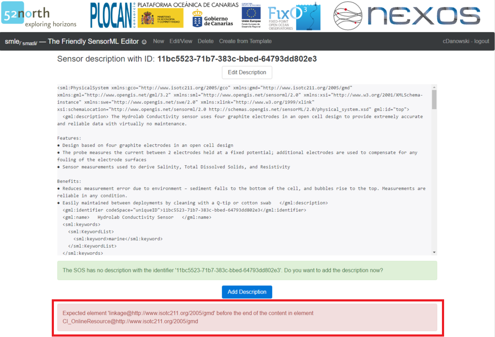
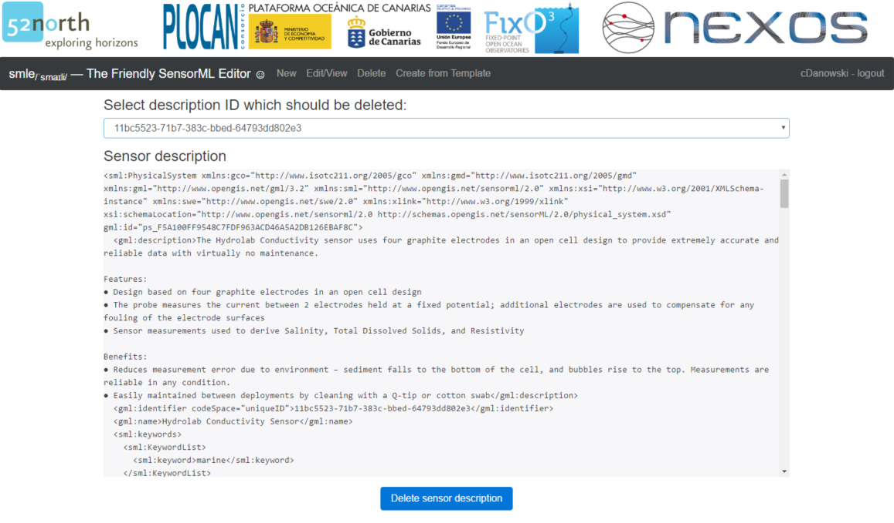

SensorML Editor (*SMLE*) Manual
===============================

This document provides helpful information on how to use the **SensorML Editor (*SMLE*\)** Web application provided by **52&deg;North**. It uses a tutorial-based manner to guide you through the basic functionalities. This documentation is based on the SMLE version from October 2016. The most current development of *SMLE* is available from the [official GitHub page of *SMLE*](https://github.com/52North/SMLE).

Basic Visual Interface of *SMLE*
--------------------------------

This section provides general information about the Web application *SMLE*. As the full name indicates, the SensorML Editor is a Web application allowing users to manage SensorML documents of a preconfigured Sensor Observation Service (SOS). This SOS instance is configured during installation by an IT-expert and is currently not changeable at runtime. *SMLE* provides a visual interface for various tasks such as viewing/editing/deleting existing SensorML documents or creating new sensor descriptions. Without logging in, the application only allows to view existing sensor descriptions. Only after a **successful login** users may perform the administrative tasks *create*, *edit*/*update* and *delete*. To log in you can use your **GitHub credentials**.

As an exemplar instance of *SMLE*, this guide uses the application from http://pilot.52north.org:3000/#/. The landing page greets you as shown in the subsequent figure.

The dark grey navigation bar contains the available functionalities of *SMLE*, which are accessible by clicking the corresponding button. Via **New** and **Create from Template**, new SensorML documents can be created. Using **Edit/View**, existing sensor descriptions can be viewed and edited. However, as mentioned above, the administrative functionalities can only be performed once logged in. In consequence, as a first step, you should log in via the **login** button located at the right of the navigation bar. This will open a popup window to enter your GitHub credentials. **Note that you may have to enable popups within your browser!**

After signing for the first time, you will have to authorize *SMLE*, allowing the application to access your GitHub account. This step is not required for subsequent logins. When logged in, the **login** button is replaced by your GitHub name and the option to logout. In addition, the navigation bar is enriched with a new button called **Delete** allowing you to delete your sensor descriptions. Having logged in, all functionalities become available. Each is introduced subsequently within its own section.

Modifiable Items and Restrictions
---------------------------------

When logged in, you are able to create, edit or delete Sensor descriptions. However, you are only allowed to modify content that you have previously created by yourself. To be more precise, you are allowed to *view* any available sensor description from any user. Also you can *create* arbitrary new SensorML documents, providing a new unique identifier. But you are not permitted to *update* or *delete* sensor descriptions from another user. Only your own documents that are linked to your account are open for modification. Due to this restriction, the application prevents users to manipulate content without permission.

Although not being allowed to modify documents of other persons, the visual interface lets you edit an existing sensor description and even click on the **Publish** and **Update** buttons (see section [Edit your own SensorML Descriptions](#edit-your-own-sensorml-descriptions) for more detailed workflow). Only then *SMLE* will notice that you tried to change the description of another user and fail. This is due to technical reasons. As the underlying SOS instance stores, which sensor description was created by which user, *SMLE* builds and executes a SOS *UpdateSensorDescription* request. If the logged in user does not have the permission to update that specific sensor description, the SOS operation fails. As an enhancement, future version of *SMLE* might inspect earlier, whether users have permission to edit a certain document and inform them via suitable means (e.g. hide the edit button on a missing permission).

Create SensorML Document from Template
--------------------------------------

*You need to be logged in in order to publish a new SensorML description.*

### Find and Select Template

The application allows to create a new sensor description based on an existing template that already fills parts of the SensorML structure. Select **Create from Template** from the navigation bar to open a new menu where you can browse and search for available SensorML templates provided by the [ESONET YELLOW PAGES](http://www.esonetyellowpages.com/). As of October 2016 380 templates are available that can be filtered through appropriate keywords. To browse all templates, simply hit the **Search** button without any keyword. To filter the templates, enter any keyword and hit the **Search** button. The following example shows all entries for the keyword *salinity*.

From the list of returned templates you may select the target template, which is used to create a new SensorML document. E.g. when selecting the template *Hydrolab Conductivity Sensor*, a description of the selected sensor as well as the option to **create a sensor description of this template** is provided. Optionally, you may already enter a new unique identifier for the new SensorML document, either manually or by clicking the **Create identifier** button, which generates a system-wide unique identifier. However, the identifier may be defined later as well.

### Instantiate and Edit new SensorML Document based on selected Template

After selecting a template (and providing a new identifier) you may click on the button **Create sensor description from template**. This will instantiate a new SensorML document using the selected template to provide the necessary SensorML elements and insert predefined values. The application switches to the edit view, where the elements of the SensorML document are displayed. On the left side, the edit view allows to *add* new metadata within various elements of the sensor description or *edit* existing properties. On the right side, you may toggle the tree view to gain an overview of the specified metadata as a tree structure.

If specified, the value of the second entry *Identifier* stores the unique identifier, which can still be modified. Optionally, you can activate the expanded view of *all available elements* by setting the checkbox of **Show all** located at the top of the edit window. If activated, additional element fields are revealed to be edited.

The process of adding new information uses a nested window design to resemble the hierarchy of the added item. As an example, the subsequent series of figures shows how to add *contact information*. Notice how with each new hierarchy level a new nested window appears, where you can add/enter new information. To close a nested windows, you may either use the **Close** button on the top right of the window or click on the vertically oriented name of a previous hierarchy element on the left.

1.	Navigate to the **Contacts** element of the SensorML document. Click on the **Add** button, which adds the item *Contact list*.

1.	Click on the newly created *Contact List* element to open it in a new nested window.

1.	Click the **Add** button to create the new item *Responsible party*.

1.	Click on **Responsible party** to open and edit it in a new nested window.

1.	Fill the form fields of the **Responsible party** element and, in addition click on **Create Contact Info**, which adds a new item called *Contact Info*. Whenever you edit any form field, the corresponding content is immediately updated with the new value. Switching back to previous hierarchy level (in this case *Physical System* or *Contact List*) is allowed at any time. All changed values have been recognized and applied by *SMLE*.

1.	Click on Contact Info to open and edit it in a new nested window.

1.	When you reach this point, you should have understood, how to edit the properties of a SensorML document using *SMLE*. Entries highlighted using *blue* colour reveal editable properties within a new nested window. Form fields represent the values of a certain property. E.g., within the **Contact** element, there are three additional elements and two form fields to be edited. Within this guide only the **Address** element is configured subsequently. So click on it to open it as a new nested window.

1.	Fill out the form fields of the **Address** element with your values. Of particular interest are the fields *Delivery point* and *E-mail*. Both have additional interactions called *Add* and *Clear*. The *Clear* button clears the entered value while the *Add* button must be clicked to persist the entered value for the property. As these specific properties allow multiple values, it is not sufficient to only enter the new value within the form field. Instead you have to explicitly *add* it.

1.	After explicitly adding the values of *Delivery point* and *E-mail*, you may enter a second value or remove any value.

1.	To finish editing the contact info you may either use the *Close* button within each nested window (located on the top right) or click on the vertically oriented name of a previous hierarchy level on the left. Using the latter, you may directly return to the leftmost window (in this case *Physical System*), which is the top-level of the SensorML Document. To verify the applied changes you may use the *tree* view on the right and expand it at the relevant elements. Alternatively navigate to the respective element within the left menu to inspect it and perform additional edits.

At this point, you should have the knowledge to edit any property of the SensorML description. You may *add* new elements or *edit* the values of a certain element in a nested window. Clicking on any item, which is highlighted using *blue* colour, will open that element as a new nested window to reflect the hierarchy of the SensorML document structure.

### Preset Structure and Values of the Template

As you may have noticed, when using a template certain elements are already pre-set with values from the template. While some values represent template-specific standard values that do not require changes, certain other elements are instantiated using *null* values. However, when relying on the template, you should have the knowledge to identify those elements and provide suitable values.

As an example, using the *Hydrolab Conductivity Sensor* template, the *Classification* element is pre-set with certain classifiers. Open this element by clicking on **Classifier list (...)**.

This will reveal a nested window with all pre-set classifiers of the template. As you can see, the value of most of the *classifiers* is set to **null** or **\-**. However, as they describe important operational characteristics of the chosen sensor, you should fill them with applicable real values. To replace/override any value, click on the corresponding item. E.g. click on **Operating depth** to open it in a new nested window.

Within the edit window you might change the label and in particular the value of the displayed item. As soon as you replace the **value** property, you may close the *Term* edit window.

Back on the hierarchy level *Classifier list* you should verify that the edited property indeed carries the new value.

As shown by this simple example, you should navigate through all pre-set values and edit them to the de facto values of the sensor for which you create the SensorML document. *SMLE* will **NOT inform** you about any property that still carries any *null* values. So you will have to carefully inspect each property by yourself. Should you wish to remove any property, you are free to do so. Basing on a template is up to your choice and only provides recommendations on how to model sensor descriptions using the SensorML standard. In theory, you are free to include the necessary information about your sensor using other properties/elements of SensorML. However, using templates and its recommended pre-set properties allows better comparability to descriptions of similar sensors.

### Publish and persist new SensorML Document

After adding or overriding the necessary properties to reflect you sensor characteristics, click on the **Publish Description** button located below the edit window. Note that you have to be logged in to see the button! If you have not specified any *identifier* for the new document you are prompted to enter it now. Again, you may let the system generate a new identifier using the **Create identifier** button, as shown in the subsequent figure. Alternatively, enter a manual value.

When publishing the document, *SMLE* will provide you with a final uneditable view of the XML structure of the new SensorML document for verification purposes. Here you should proofread all the edited properties/elements. When detecting an error or some other reason to return to the edit view, use the **Edit Description** button located above the XML view. If you are satisifed with the preview of the new SensorML document, you find a notification below the XML preview. *SMLE* contacts the SOS instance to check, whether the identifier of the new SensorML instance already exists within the SOS. If not, it informs you about this and offers you a button called **Add Description** to persist the created document within the SOS.

After clicking the button, you are notified whether the process was successful. (e.g. note the success message at the bottom of the following figure. Occurring errors are described in sub-section [Error Handling](#error-handling) below.)

Should the identifier already exist within the SOS, You are asked if you want to *update* the existing document using an **Update Description** button. Here you should carefully decide what to do. If you created a new SensoML instance for a new sensor, the *identifier* should be new as well. If you receive a notification that the *identifier* already exists, you should edit the document and alter the property.

Once persisted within the SOS, you are still able to edit the document using the **Edit Description** button and re-publish the document. In this case the identifier should remain untouched to only *update* the existing document within the SOS.

### Error Handling

When trying to publish a SensorML document, the underlying SOS might return with an error message in case the SensorML document does not conform to the requirements of the SOS and SensorML standard. An error message may have several reasons. To mention a few: a needed element may not be specified, empty elements may not be allowed or provided property values do not pass validity checks. If the SOS rejects the SensorML document for whatever reason, *SMLE* displays the error message at the bottom of the publish view, according to the next figure.

Currently, the displayed error message is forwarded from the SOS instance and should indicate what kind of error occurs. Hopefully, the message contains a hint on how to edit the SensorML document to make it valid. In this case the error message notifies you of a missing required element called *linkage* within the higher-level element *CI_OnlineResource*. Sadly, there is no indication on where to find the latter. To troubleshoot the problem in worst case scenario, edit the document and inspect every hierarchy level to find the required element and provide a proper value for it. For instance, the created *Contact* element defines an element **Online Resource** with the property **Linkage**. So, navigate to *Contact List - Responsible Party - Contact (Contact Info) - Online Resource* to enter a suitable value, as shown in the following figure.

After that hit the **Publish Description** button again to open the publish view and add/update the new sensor description. If no other error occurs, the SOS will then save the transmitted document.

Create new SensorML Document
----------------------------

In contrast to creating a new SensorML instance using a template, you are free to create a completely new document via the menu **New** from the navigation bar. As first step you are prompted to choose the *descriptionType* of the new document instance. Currently you can choose between *PhysicalSystem* for single sensor devices and *PhysicalComponent* for sensor components within a multisensor component-based setting.

After selection you enter the *edit view*, where you can add necessary sensor information using dedicated elements and properties of the SensorML standard. The process of adding/editing information as well as the process of publishing the document has already been described in the previous section [Create SensorML Document from Template](#create-sensorml-document-from-template). Thus, it is skipped here.

As you notice, the created document is still empty, as you start editing from the scratch. Whether you decide to edit an empty description or base on an existing template is up to you. However, it is recommended to start using a template, if possible. The pre-set structure generated by the template may allow better comparability between similar SensorML documents of similar sensor settings.

View existing SensorML Descriptions
-----------------------------------

To view existing sensor descriptions, you do not have to be logged in. Navigate to the menu **Edit/View** from the navigation bar to find a dropdown with the available SensorML documents.

After selecting a certain document, *SMLE* provides you with a collapsed tree structure of the elements of the SensorML document, as shown in the subsequent figure.

You can inspect each element with a leading horizontal arrow by clicking on it to reveal the next level of the tree structure. Leaf node values are marked using orange colour and surrounding quotes while attribute values are marked using blue colour. Alternatively, the XML equivalent of the SensorML document can be viewed by switching to the **as XML** tab.

Below both views you find two buttons **Edit sensor description** and **copy sensor description**. While the former allows you to edit the existing document (as identified by its unique ID) the latter creates a copy of the currently selected SensorML instance but removes its *unique identifier*, causing you to provide a new *identifier* within the edit view. Note that although you might not be logged in, you still see both buttons allowing you to switch to the corresponding views.

Edit your own SensorML Descriptions
-----------------------------------

*You need to be logged in in order to edit an existing SensorML description. Also you are only allowed to edit sensor descriptions that you have created with your account.*

To edit a previously created SensorML document, click on the menu **Edit/View** from the navigation bar and select the **id** of the document you intend to edit. This will provide you with the view window as already described in the previous section. To edit the document click on **Edit sensor description**, which opens the edit view, where all stored information of the selected document is displayed. Here you can apply changes like add missing information or override/remove existing elements/properties. The process of editing has already been described in section [Create SensorML Document from Template](#create-sensorml-document-from-template) and is skipped here. Please refer to that section for details. After editing you can re-publish the document by updating the document using the same *identifier*.

### Role of the unique Identifier

Each stored SensorML document stored in the SOS is referenced by its unique *identifier*. When you intend to only update an existing sensor description, it is vital that you leave the *identifier* untouched. When you change it and then publish the document, you will create a whole new additional document, under the assumption that the new identifier does not exist yet. In a worse case the modified identifier references a different existing SensorML instance dscribing a different sensor. As a consequence, you should always carefully check the *identifier* property and associated notification messages of *SMLE* to prevent false publishing of a document.

### Restriction to only edit your own Content

You are enabled to view and edit any available SensorML document of the underlying SOS. However, when trying to re-publish/update a modified SensorML document, which is not linked to your account, *SMLE* will inform you that you miss the appropriate permission, as the underlying SOS rejects the update from the non-authorized user.

As a result, you are only allowed to update sensor descriptions that you have created with your current account. To still save the modifications of a certain sensor description, for which you do not have the sufficient permission, you might change its *identifier* and thus create an additional sensor description. Mind that this process preserves the *old* sensor description and creates a modified *new* version using a different *identifier*. Whether this approach is applicable is up to you and your working environment.

Delete your own SensorML Descriptions
-------------------------------------

*You need to be logged in in order to delete a SensorML description. Also you are only allowed to delete sensor descriptions that you have created with your account.*

To delete a previously created sensor description navigate to menu **Delete**. Note that this menu is only available after successful login. Within the delete view, you choose the desired document via a dropdown list.

After selection you see the XML structure of the selected document. Inspect it to verify that this is the desired document, which should be deleted. By clicking the **Delete sensor description** button, you will irretrievably delete the document! *SMLE* will not prompt you with an additional conformation request.

As a result, the document is deleted from the underlying SOS and *SMLE* displays a success message.

### Restriction to only delete your own Content

Similar to the restriction of editing your own content, you are also only authorized to delete any SensorML document that is linked to your current account. You are not allowed to delete the descriptions of another user.
